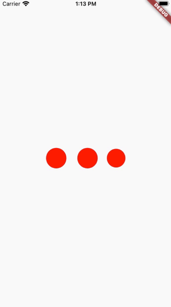

# nintendo_progress_indicator

A progress indicator meant to emulate the Nintendo.com website indeterminate progress indicator.



## Getting Started
Simply include the package, and import it into the Stateful or Stateless Widget of your choice.
Include it in your stack with:

```dart
NintendoProgressIndicator()
```

